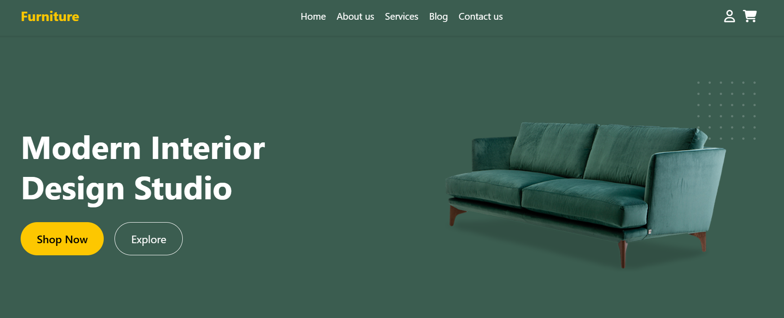

# 🪑 Furniture Landing Page

Beautiful & responsive landing page for a modern furniture brand.  
Built with **HTML5 + Tailwind CSS** and enhanced with **smooth animations** and clean UI components.

## 🎯 Key Features

- ✨ **Scroll animations** using `@keyframes` & `Tailwind` utilities
- 🧩 Modular layout: hero, product, blog, subscribe, footer
- 📱 Fully responsive on all devices
- 🎨 Clean & minimal design
- 🧠 Smooth UX: transitions, hovers, bounce, and slide-in effects

## 🎥 Animations Included

| Element | Animation |
|--------|------------|
| Hero text & sofa | `fade-in` + `slide-up` |
| Product cards | `hover scale` + `fade` |
| Sofa (newsletter) | `float-updown` infinite |
| Blog cards | `slide-in from left` |
| Testimonials image | `bounce` |
| Section scroll | `smooth-scroll CSS` |

## 🛠 Tech Stack

- **HTML5**  
- **Tailwind CSS** (Utility-first styling)  
- **Font Awesome 6** (Social Icons)  
- **Vanilla JS** (Mobile navbar toggle)

## 🌍 Live Preview

[Vercel](https://furniture-landing-page-modern.vercel.app/),
[GitHub Pages](https://github.com/mehedihasanrabbivip), 

 

## 📚 Daily Learning Note

> “I try **not to learn** one new thing every day —  
> that’s how I accidentally **learn too much**.” 😄  
> – _The Dev Who Builds Without Burnout_

## 💌 Contact

Want help, improvements, or ideas?  
📩 **mehedihasanrabbivip@gmail.com**

## 🪪 License

MIT — Free to use & modify. No attribution required.
